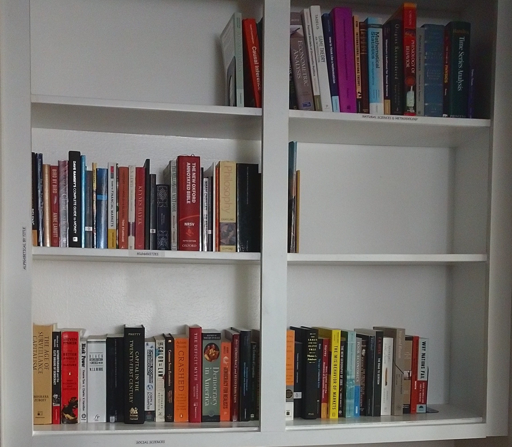

<section>
<h1 align="right"> Academic Biography </h1>
  
 
  

  
 I am a political science PhD student at Texas A&M University-College Station studying political economy. I primarily seek to understand how shifts in the geopolitical landscape and great power competition affect global finance outcomes (e.g., foreign aid) for developing countries. In addition, I am interested in illuminating the political consequences of increasingly sophisticated information and communication technologies (ICTs).
  

  
 Download my CV <a href=Ray_CV.pdf>here. <i class="glyphicon glyphicon-save"></i></a>
  

  
 My ORCID<i class="fa fa-regular fa-registered" style="font-size: 0.6em;position:absolute;"></i> &nbsp; iD is:  <a href=https://orcid.org/0000-0003-2766-9567> 0000-0003-2766-9567. </a>
  

  
 Here is the link to my <a href=https://github.com/nnray> GitHub <i class="fa fa-github fa-lg"></i></a> repositories.
  

<section>
<h1 align="left"> Personal Interests </h1>
  
 
  

  
 I love to read and build my small library. I enjoy mostly non-fiction, including philosophy, social science books, and books about the natural sciences. My favorite book is Plutarch's Lives of the Noble Greeks and Romans (simply, Plutarch's Lives).
  

  
 I also really enjoy running. One of my favorite things to do is to trail run in a state park or at the nearby Lake Bryan.
  

</section>