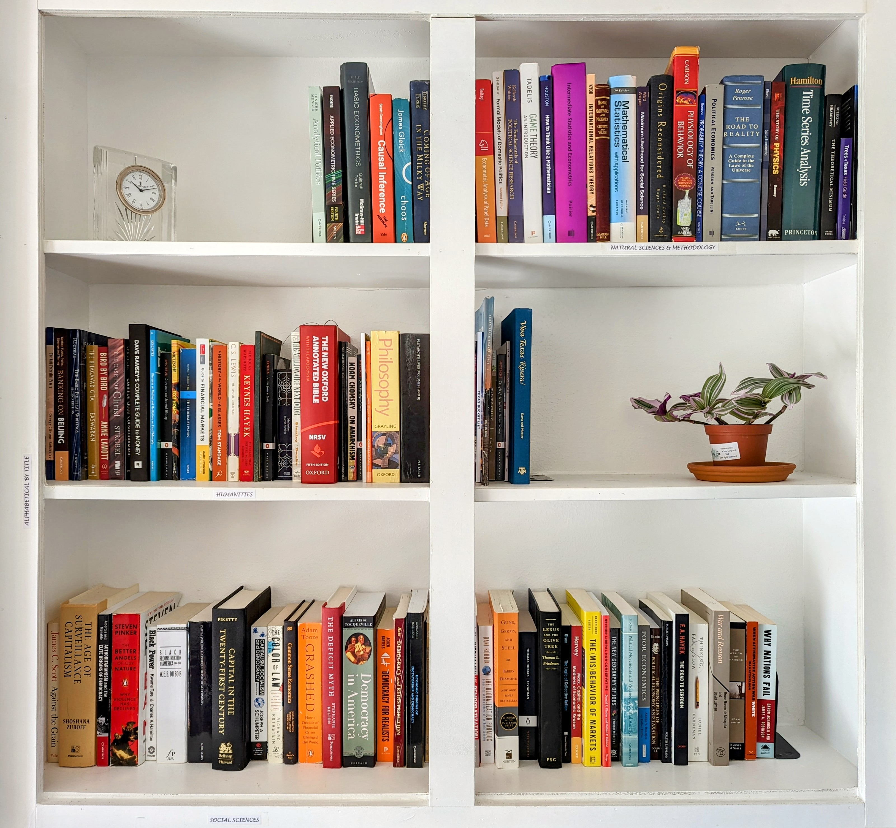

<head> <meta Nicholas Norfleet Ray/>
  <!-- Google tag (gtag.js) -->
  
  
  <meta Political Science/>
  <meta Texas A&M University/>
</head>
<section>
<h1 align="right"> Academic Biography </h1>
  
 
  

  
 I am a political science PhD student at Texas A&M University-College Station majoring in comparative politics and minoring in both international relations and quantitative methods. I study the relationship between the global economy and domestic politics, which typically corresponds to the subfield of international political economy (IPE). My current research interests center on understanding who has lost from globalization and the variation in how they have been compensated.
  

  

  
   
   
  <a href=https://github.com/nnray> <i class="fa fa-github fa-lg" style=" vertical-align: middle;" ></i></a>
  
  
  

</section>
  
<section>
<h1 align="left"> Personal Interests </h1>
  
 
  

  
 I like to read and build my small library. I enjoy mostly non-fiction, including philosophy and books about both the social and natural sciences. My favorite book is Plutarch's <a href=https://penelope.uchicago.edu/Thayer/e/roman/texts/plutarch/lives/home.html><u>Lives of the Noble Greeks and Romans</u></a>- or simply, Plutarch's <u>Lives</u>.
  

  
 I also enjoy running. One of my favorite things to do is to trail run in a state park or at the nearby Lake Bryan.
  

</section>